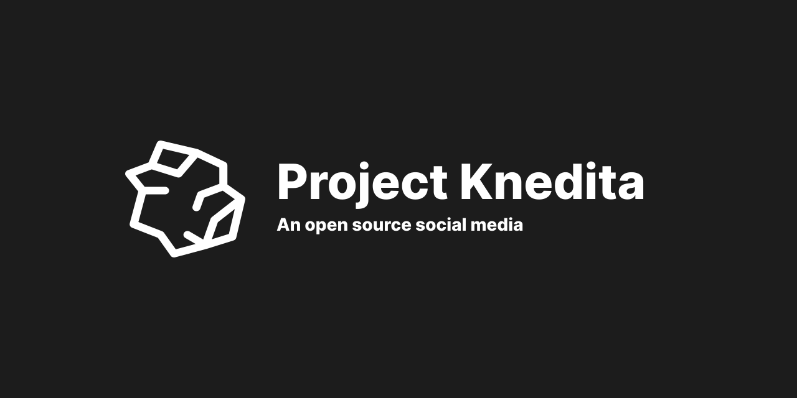

## Stack

**Client**: NextJS, TailwindCSS and Radix UI Icons.
You can find the front-end [here](https://github.com/CookieDasora/project-knedita-client)

**Server**: ExpressJS, Jest, Docker, Postgresql, Redis, Prisma, AWS, SWC and Typescript

## To-do - Backend

- Create/update/delete Posts ✅
  - Add post attachments
- Create/update/delete Users ✅
- Password recuperation
- Two step verification
- Able to choose a profile picture✅
  - Probably gonna use LocalStack to mock Amazon S3✅
  - Image compression ✅
- Following/unfollowing features ✅
- Like posts ✅
- Authentication ✅
  - Add more verification (like, if the password is too short) ✅
- Set display name ✅
- Add rate limit ✅

## License

[MIT](https://choosealicense.com/licenses/mit/)
