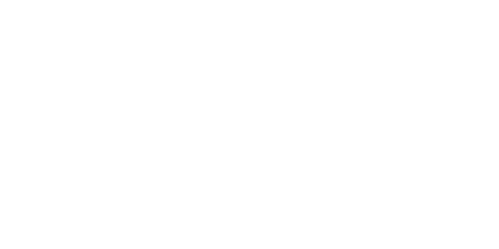

<p align="center">
  <picture>
    <source media="(prefers-color-scheme: dark)" srcset="./resources/logo-light.svg">
    <source media="(prefers-color-scheme: light)" srcset="./resources/logo-dark.svg">
    
  </picture>
</p>

A simple RESTful API made with **NestJS** and **Fastify**.  

### 🚀 Preparing the environment 

Make sure that you have Node, NPM, Docker and Docker Compose installed on your computer.

First, install the necessary packages with the following commands:

```bash
$ npm i 
```

After that, you can update the `.env` and the `docker.env` files. The `.env` file is for development environment and the `docker.env` is for production.

You can find the templates for those files on `.env.example` and `docker.env.example`.

To run the necessary services you can execute the following command:

```bash
$ npm run docker:db
```

This will start the following services:
 - **PostgreSQL**
 - **Redis**
 - **MinIO**

Apply the migrations to the database with the following command:

```bash
$ npm run migrate:dev
```

And now, you can start the server with the command:

```bash
$ npm run dev:start
```

You can check the documentation accessing the endpoint `/` in your browser

To run in production you can use the following command:

```bash
$ npm run docker
```

This will start all the previous services and the back-end image.

## 🗄️ Stack

This back-end uses the following stack:
 - **Docker**
 - **Fastify**
 - **MinIO**
 - **NestJS**
 - **Passport**
 - **PostgreSQL**
 - **Prisma**
 - **Redis**
 - **Swagger**
 - **Typescript**

## License

[MIT](https://choosealicense.com/licenses/mit/)
